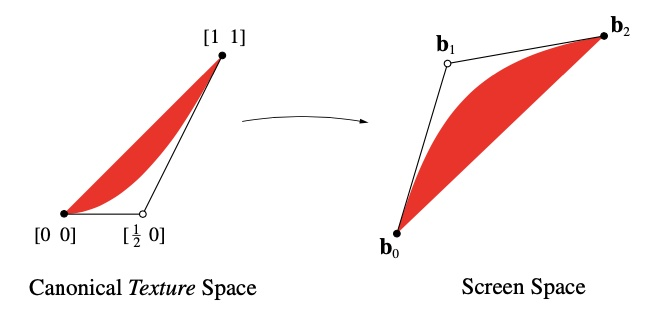

# 分辨率无关的曲线渲染

`Charles Loop`和`Jim Blinn`在 _Resolution Independent Curve Rendering using Programmable Graphics Hardware_ 文章中提出了一种在 GPU 上渲染有理曲线的方法，核心思想是：对于任意有理曲线方程，可以在着色阶段找到与之对应的隐式方程评估像素的值；隐式方程参数是有理曲线基的线性组合，可以由 GPU 插值处理，在任何投影变换下都满足此方程。

在理解这个方法为什么有效之前，先以一个简单例子，渲染二次贝塞尔曲线举例，了解实现过程：

假设三角形的顶点是二次贝塞尔控制点$\bold{b_0}$、$\bold{b_1}$和$\bold{b_2}$，将这些顶点与$\begin{bmatrix}u&v\end{bmatrix}$纹理坐标$\begin{bmatrix}0&0\end{bmatrix}$、$\begin{bmatrix}\frac{1}{2}&0\end{bmatrix}$和$\begin{bmatrix}1&1\end{bmatrix}$相关联。在光栅化过程中，GPU 将插值三角形中每个像素的纹理坐标，并通过以下隐式方程评估像素在曲线内或外：

$$f(u,v)=u^2-v$$

在片源着色器中，如果$f(u,v)<0$则像素在曲线内部，否则在曲线外部。

  

<small>二次曲线分别在纹理空间（左）和屏幕空间（右）</small>
 

此方案主要有三点优势：

1. 分辨率无关：分辨率无关意味着基于矢量的图像的弯曲程度总是一致的，与视点无关。
2. 紧凑的数据组织：曲线的表示由一组三角形组成，这些三角形与矢量图像的设计时间复杂度成正比。
3. 高性能：数据量通常比同等质量的光栅图像小十倍，着色器程序简单，并行执行，速度极快。

## 预备知识

### 参数曲线

在二维空间，平移是一个比较特殊的变换，它是非线性的，为了将它和线性变换统一起来，在二维的基础上拓展一个维度，用更高维度的线性变换来表示仿射变换。

  

<small>低维仿射变换到高维线性变换</small>
 

对于投影到二维空间的点，通常使用$\begin{bmatrix}x&y&w\end{bmatrix}$表示，点在平面的位置为$\begin{bmatrix}\frac{x}{w}&\frac{y}{w}\end{bmatrix}$。

参数曲线是单个变量的向量值函数。通过对参数值$t$处的函数进行采样，可以找到曲线上的点。$n$次的有理参数曲线表示为：

$$C(t)=\bold{t}\cdot\bold{C}\\ where\ \bold{t}=\begin{bmatrix}1&t&\cdots&t^n\\\end{bmatrix},\ and\ \bold{C}=\begin{bmatrix}x_0&y_0&w_0\\x_1&y_1&w_1\\\vdots&\vdots&\vdots\\x_n&y_n&w_n\\\end{bmatrix}$$

矢量$\bold{t}$包含曲线参数方程的幂基，$\bold{C}$是描述曲线形状的矩阵，有理曲线$C(t)$具有分量$\begin{bmatrix}x(t)&y(t)&w(t)\end{bmatrix}$。参数曲线可以以任何线性独立的基表示，替换为伯恩斯坦基表示曲线：

$$B(t)=\begin{bmatrix}B_0^n(t)&B_1^n(t)&\cdots&B_n^n(t)\end{bmatrix}\cdot\bold{B}\\[10pt] where\ B_i^n(t)=\begin{pmatrix}n\\i\end{pmatrix}(1-t)^{n-i}t^i,\ \begin{pmatrix}n\\i\end{pmatrix}=\frac{n!}{i!(n-i)!},\ and\ \bold{B}=\begin{bmatrix}\bold{b_0}&\bold{b_1}&\cdots&\bold{b_n}\end{bmatrix}$$

$\bold{B}$是由贝塞尔曲线控制点构成的$n \times 3$矩阵，从幂基变换为伯恩斯坦基是一种可逆的线性运算，实现为系数矩阵乘以基矩阵的$n \times n$变化

$$\bold{C}=\bold{M_i}\cdot\bold{B}$$

对于二次和三次贝塞尔曲线来说，变化矩阵分别为：

$$\bold{M_2}=\begin{bmatrix}1&0&0\\-2&2&0\\1&-2&1\\\end{bmatrix},\ \bold{M_2^{-1}}=\begin{bmatrix}1&0&0\\1&\frac{1}{2}&0\\1&1&1\\\end{bmatrix}$$

$$\bold{M_3}=\begin{bmatrix}1&0&0&0\\-3&3&0&0\\3&-6&3&0\\-1&3&-3&1\end{bmatrix},\ \bold{M_3^{-1}}=\begin{bmatrix}1&0&0&0\\1&\frac{1}{3}&0&0\\1&\frac{2}{3}&\frac{1}{3}&1\\1&1&1&1\end{bmatrix}$$

## 隐式曲线

一条由$\begin{bmatrix}x&y\end{bmatrix}$表示的零集隐式曲线为：

$$c(x,y)=0$$

几何意义为由$\begin{bmatrix}x&y\end{bmatrix}$表示的平面所有结果为零的点，隐式和参数形式之间的关系是 Sederberg 博士的主题。他指出，一个多世纪以来，消除理论中已经知道了许多在参数形式和隐式形式之间转换所需的工具。采用符号$c^n(\cdot)$表示最大次数为$n$的多项式，我们重复 Sederberg 博士指出的结果：

_由参数方程定义的任何曲线_

$$x=\frac{x^n(t)}{w^n(t)},\ y=\frac{y^n(t)}{w^n(t)}$$

_将有一个隐式方程_

$$c^n(x,y)=0$$

值得注意的是，通常情况并非如此。也就是说，并非所有隐式曲线都可以通过有理多项式参数化。出于我们的目的（假设没有降维的退化）二次参数曲线将具有 2 次隐式方程（圆锥截面）；三次参数曲线将具有 3 次隐式方程。请注意，许多参数曲线可能具有相同的隐式形式。这是因为参数曲线表示底层代数曲线的特定参数化。给定的代数曲线可能有无限多个参数化。

## 渲染二次贝塞尔曲线

论文中假定任何有理二次参数曲线都满足隐式方程，然后通过证明来找到隐式方程纹理坐标与有理二次参数曲线控制点的对应关系。

证明过程如下：

**主张 1：** _对于任何有理二次参数曲线都有一个隐式形式，它是代数曲线的投影图像_

$$f(u,v)=u^2-v$$

**证明：** 从任意有理二次参数曲线开始

$$C(t)=\bold{t}\cdot\bold{C}\\ where\ \bold{t}=\begin{bmatrix}1&t&t^2\\\end{bmatrix},\ and\ \bold{C}=\begin{bmatrix}x_0&y_0&w_0\\x_1&y_1&w_1\\x_2&y_2&w_2\\\end{bmatrix}$$

与以下曲线比较：

$$F(t)=\bold{t}\cdot\bold{F}\\ where\ \bold{F}=\begin{bmatrix}0&0&1\\1&0&0\\0&1&1\\\end{bmatrix}$$

对于曲线$F$有$u(t)=t$和$v(t)=t^2$，因此具有所需的隐式方程：

$$f(u,v)=u^2-v=0$$

总能找到一个变换矩阵$Ψ$满足：

$$\bold{C}=\bold{F}\cdot\bold{Ψ^{-1}}$$

很明显$\bold{Ψ^{-1}}=\bold{F^{-1}}\cdot\bold{C}$，所以有$C(t)=\bold{t}\cdot(\bold{F}\cdot\bold{Ψ^{-1}})$，因此参数曲线$C(t)$属于隐式曲线$f(u,v)$的变换图像。

通过将基矩阵的变化应用于规范曲线的系数得到纹理坐标：

$$\bold{M_2^{-1}}\cdot\bold{F}=\begin{bmatrix}0&0&1\\\frac{1}{2}&0&1\\1&1&1\\\end{bmatrix}$$

通过忽略$w=1$分量，使用$\begin{bmatrix}0&0\end{bmatrix}$、$\begin{bmatrix}\frac{1}{2}&0\end{bmatrix}$和$\begin{bmatrix}1&1\end{bmatrix}$作为$\begin{bmatrix}u&v\end{bmatrix}$纹理坐标，来分别对应以三角形顶点$\bold{b_0}$、$\bold{b_1}$和$\bold{b_2}$表示的任何二次曲线。

未完待续
